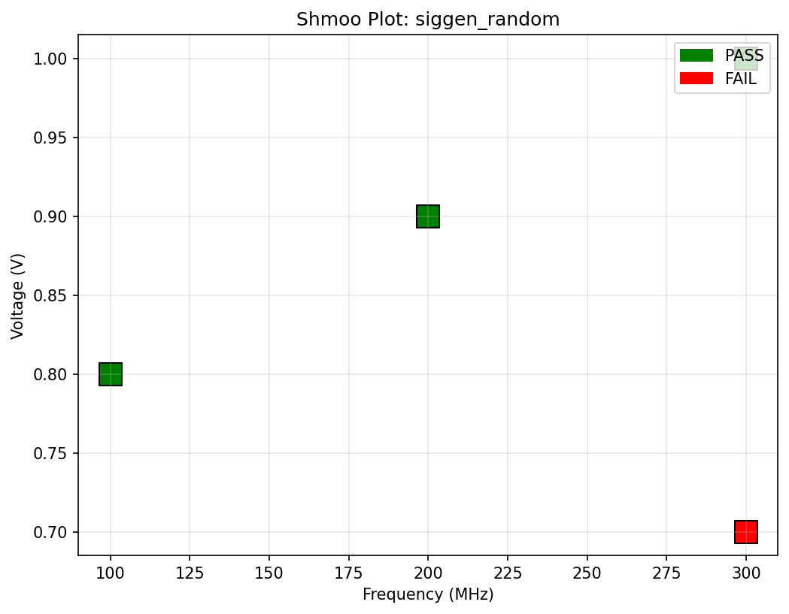
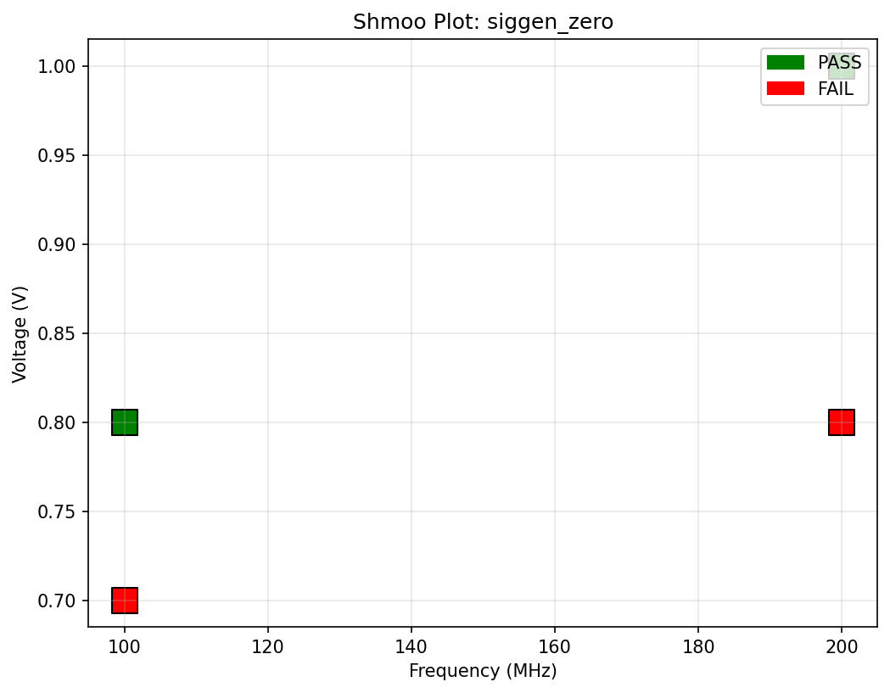

# AutoShmoo CI

Automatic generation of shmoo plots from hardware sweep reports, with full CI/CD integration.

<!-- CI Badge: replace YOUR_USERNAME/autoshmoo-ci with your actual GitHub path -->


## Example Output

These plots are regenerated automatically by CI on every merge to main.





## What It Does

AutoShmoo reads `.rpt` files from hardware sweep tools, extracts voltage/frequency/pass-fail data, and generates:

- A summary table (CSV + Markdown)
- Shmoo plots (pass/fail by voltage vs. frequency)
- Power summary charts

Everything runs automatically in GitHub Actions when a branch is merged into main.

## Quick Start

```bash
# Clone the repo
git clone https://github.com/vvedn/shmoo-generator.git
cd autoshmoo-ci

# Create a virtual environment
python -m venv .venv
source .venv/bin/activate

# Install the project and dev dependencies
pip install .[dev]

# Run the tool on sample data
python -m autoshmoo generate examples/sample_project/reports --out outputs

# Run tests
pytest
```

## Project Structure

```
autoshmoo-ci/
├── autoshmoo/          # Main Python package
│   ├── parser.py       # Parse .rpt files and group by signal generator
│   ├── plots.py        # Generate shmoo and power plots
├── examples/           # Verilog source and sweep reports
├── tests/              # Unit tests (pytest)
├── outputs/            # Generated artifacts (committed by CI)
└── .github/workflows/  # CI pipeline
```

## Branching & PR Strategy

1. **`main`** branch is always stable and CI-passing. Never commit directly to main.
2. **Feature branches** are created for each signal generator's verilog source and sweep reports.
3. When a feature branch is merged into `main` via pull request, the CI pipeline:
   - Runs linting and tests
   - Parses all report files
   - Generates shmoo plots
   - Commits the generated outputs back to the repo

**Example workflow:**

```bash
# Create a branch for a new signal generator
git checkout -b feat/siggen-sawtooth

# Add verilog source and sweep reports
git add examples/sample_project/verilog/siggen_sawtooth.v
git add examples/sample_project/reports/siggen_sawtooth.rpt
git commit -m "feat(data): add siggen_sawtooth design and sweep results"

# Push and open a PR
git push -u origin feat/siggen-sawtooth

# Open PR on GitHub -> review -> merge
# CI runs automatically and commits the updated shmoo plots to main
```

## Requirements

- Python 3.11+
- pandas
- matplotlib
- tabulate
- pytest (dev)
- ruff (dev)
